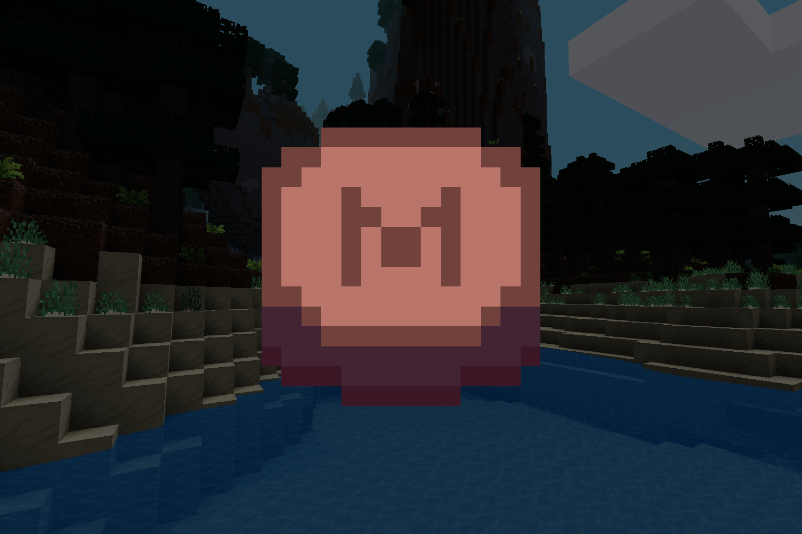

# MUDPatch

A mod that connects all the other mods in my survival world. If you want, you can also play the same mods with the patch by installing the dpendencies of this mod.

# Mods used in my survival world

- [3d_armor](https://content.minetest.net/packages/stu/3d_armor/)
- [animalia](https://content.minetest.net/packages/ElCeejo/animalia/)
- [awards](https://content.minetest.net/packages/rubenwardy/awards/)
- [bonemeal](https://content.minetest.net/packages/TenPlus1/bonemeal/)
- [crusty_pizza](https://github.com/MihinMUD/Crusty_Pizza) (Made by me!)
- [default](https://content.minetest.net/packages/Minetest/minetest_game/)
- [farming redo](https://content.minetest.net/packages/TenPlus1/farming/) 
- [headanim](https://content.minetest.net/packages/Lone_Wolf/headanim/)
- [homedecor_modpack](https://content.minetest.net/packages/mt-mods/homedecor_modpack/)
- [i3](https://content.minetest.net/packages/jp/i3/)
- [mesecons](https://content.minetest.net/packages/Jeija/mesecons/)
- [sandwiches](https://content.minetest.net/packages/Annalysa/sandwiches/)
- [signs_lib](https://content.minetest.net/packages/mt-mods/signs_lib/)
- [skinsdb](https://content.minetest.net/packages/bell07/skinsdb/)
- [techage_modpack](https://content.minetest.net/packages/joe7575/techage_modpack/)
- [unifieddyes](https://content.minetest.net/packages/mt-mods/unifieddyes/)
- [waffles](https://content.minetest.net/packages/GreenXenith/waffles/)
- [wielded_light](https://content.minetest.net/packages/bell07/wielded_light/)
- [xdecor](https://content.minetest.net/packages/Wuzzy/xdecor/)